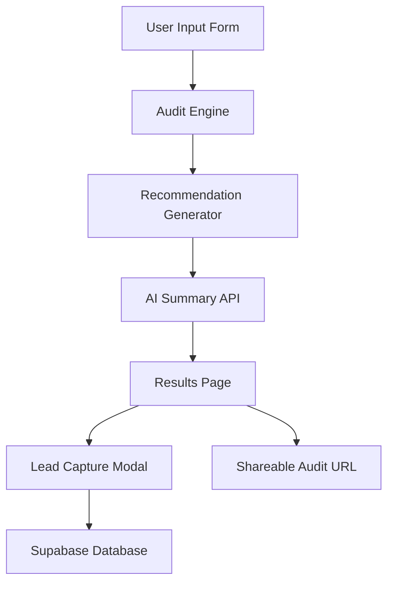

# Architecture

## Stack

- Next.js
- TypeScript
- Tailwind CSS
- Supabase
- HuggingFace Inference API

## Data Flow

1. Users select their AI tools, plans, seats, spend, and use case.
2. The audit engine analyzes the stack using rule-based logic.
3. Recommendations and savings estimates are generated.
4. The AI summary API creates a short executive summary with fallback handling.
5. Results are shown on the audit page.
6. Lead information and audit data are stored in Supabase.
7. Each audit gets a shareable public URL.

## Why This Stack

Next.js was chosen because it provides API routes, dynamic routing, and a smooth full-stack workflow.

TypeScript helps keep the audit logic safer and easier to maintain.

Supabase was chosen for quick backend setup and easy database integration.

Tailwind CSS was used for faster UI development and responsive layouts.

## Scaling Considerations

If the app needed to support thousands of audits per day:
- Audit calculations would move to dedicated backend services
- Pricing data would be cached and centralized
- Queue systems and rate limiting would be added for AI summary generation
- Monitoring and analytics would be added
- CDN caching would be used for public audit pages