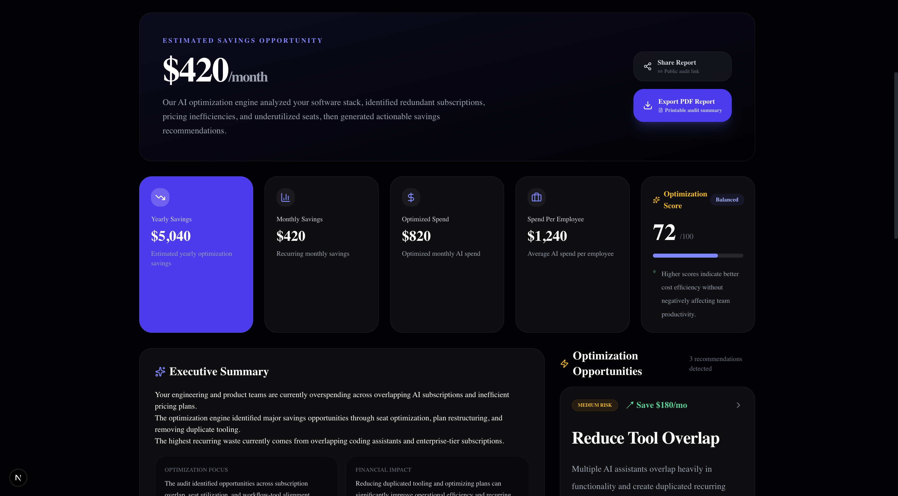
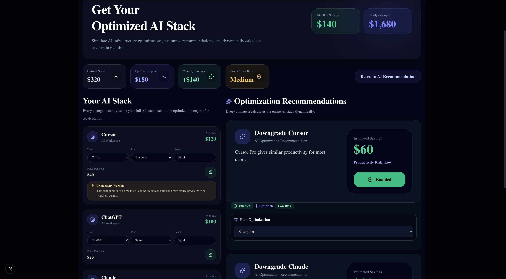

# StackAudit

StackAudit is an AI spend auditing tool built for startups and small teams to analyze AI subscription costs, detect overspending, and recommend better pricing or tool choices.

The project is designed as a lead-generation product for Credex by helping teams understand where they can optimize their AI stack spending.

---

## Problem

Startups and engineering teams often overspend on overlapping AI subscriptions like ChatGPT, Claude, Cursor, Copilot, and Gemini without realizing how much waste exists across seats and plans.

Many teams purchase multiple AI tools with similar functionality, leading to unnecessary recurring expenses and poor visibility into actual ROI.

---

## Solution

StackAudit analyzes AI tool usage, pricing, seat allocation, and overlapping functionality to generate optimization recommendations and estimated yearly savings.

The platform combines rule-based financial analysis with AI-generated summaries to produce actionable optimization reports for engineering teams.

---

## Features

- AI tool spend audit
- Savings analysis
- Tool overlap detection
- Plan downgrade recommendations
- AI-generated executive summaries
- Shareable audit result pages
- Lead capture with Supabase
- CI/CD pipeline with GitHub Actions
- Benchmark analysis
- Spend-per-employee metrics
- Optimization scoring
- PDF export support
- Share/copy audit links
- Rule-based recommendation engine
- Audit engine testing with Jest

---

## Screenshots

### Landing Page


### Dashboard


### Optimization


### Mobile View


---

## Tech Stack

- Next.js
- TypeScript
- Tailwind CSS
- Supabase
- OpenRouter API
- Jest
- html2canvas
- jsPDF

---

## Architecture Overview

User Input → Audit Engine → Recommendation Generator → AI Summary → Dashboard/PDF Export

---

## Project Structure

- `app/` → Next.js routes and pages
- `components/` → reusable UI sections
- `lib/` → audit engine and business logic
- `hooks/` → custom React hooks
- `data/` → AI pricing data
- `types/` → shared TypeScript types

---

## Local Setup

```bash
npm install
npm run dev