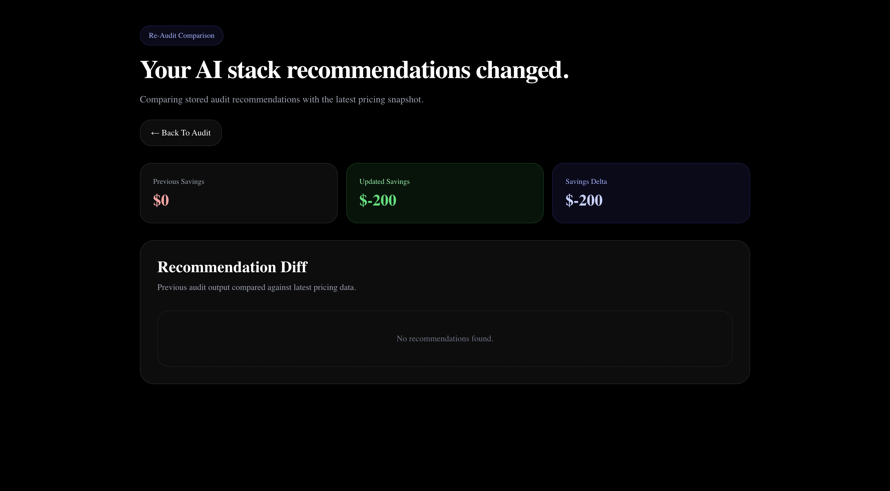
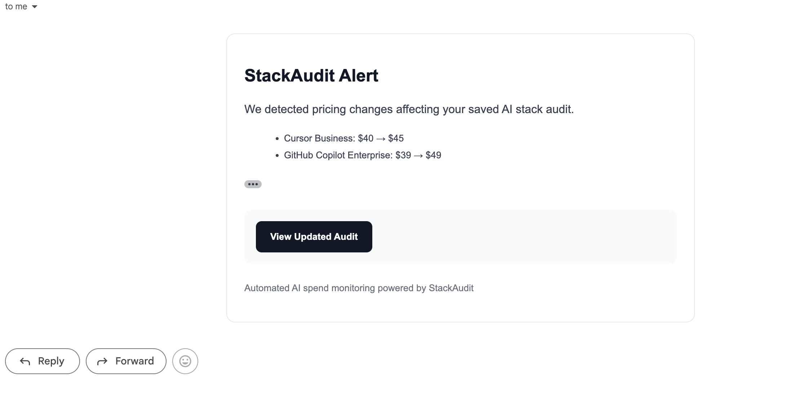
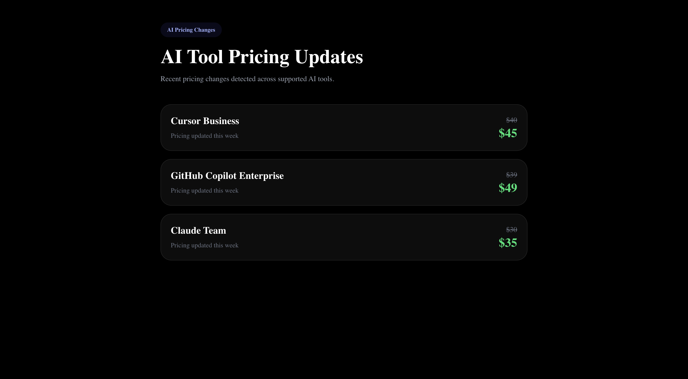

# StackAudit

StackAudit is an AI spend auditing tool built for startups and small teams. It analyzes AI subscription costs, detects overspending, and recommends better pricing or tool configurations.

The project is built as a lead-generation product for Credex by helping teams understand and optimize their AI stack spending.

---

## Problem

Startups and engineering teams often overspend on overlapping AI subscriptions such as ChatGPT, Claude, Cursor, Copilot, and Gemini without clear visibility into redundancy or actual usage efficiency.

As teams adopt more AI tools, they frequently end up paying for multiple services with similar capabilities, leading to unnecessary recurring costs and reduced ROI clarity.

---

## Solution

StackAudit analyzes AI tool usage, pricing, seat allocation, and overlap between tools to generate optimization recommendations and estimated savings.

The system combines deterministic rule-based financial analysis with AI-generated summaries to produce clear and actionable optimization reports.

Round 2 extends the platform with persistent audit storage and automated re-audit detection when AI pricing changes.

---

## Features

- AI tool spend audit
- Savings estimation and analysis
- Tool overlap detection
- Plan downgrade recommendations
- AI-generated executive summaries
- Shareable audit report pages
- Lead capture integration with Supabase
- Benchmarking insights
- Spend-per-employee metrics
- Optimization scoring system
- PDF export support
- Shareable audit links
- Rule-based recommendation engine
- Audit engine testing with Jest
- Persistent audit storage
- Automated re-audit detection
- Pricing snapshot tracking
- Compare-page diff view
- AI pricing change notifications
- Scheduled re-audit checks
- Public pricing updates page

---

## Screenshots

### Landing Page


### Dashboard


### Optimization View


### Mobile View


### Re-Audit Compare View


### Pricing Change Email


### Pricing Updates Feed


---

## Tech Stack

- Next.js
- TypeScript
- Tailwind CSS
- Supabase
- OpenRouter API
- Brevo SMTP API
- Jest
- html2canvas
- jsPDF

---

## Architecture Overview

User Input → Audit Engine → Persistent Audit Storage → Pricing Snapshot Tracking → Re-Audit Detection → Email Notification → Compare View / Results Dashboard

---

## Project Structure

- `app/` → routes and API endpoints
- `components/` → reusable UI components
- `lib/` → core business logic and audit engine
- `hooks/` → custom React hooks
- `data/` → pricing and tool configuration
- `types/` → shared TypeScript definitions

---

## Key Round 2 Routes

### Re-audit detection

```bash
POST /api/detect-changes
```

Detects pricing changes and regenerates stale audits.

---

### Pricing simulation

```bash
POST /api/simulate-price-change
```

Simulates AI pricing updates for testing the re-audit workflow.

---

### Compare page

```bash
/audit/[id]/compare
```

Shows original vs updated recommendations and savings deltas.

---

### Pricing updates page

```bash
/changes
```

Displays simulated AI pricing updates.

---

## Local Setup

```bash
npm install
npm run dev
```

---

## Production Deployment

Deployed on Vercel with:
- Supabase persistence
- Brevo email delivery
- scheduled re-audit checks
- production-ready compare flows

---

## Reviewer Quick Test

### Create an audit

Open:

```bash